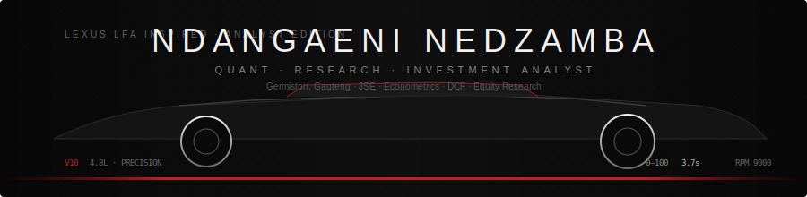

<div align="center">



### *The pursuit of precision — in markets, models, and research.*

<br/>


<br/>

[](https://github.com/Ndanga02?tab=followers)
[](https://www.linkedin.com/in/ndanganeninedzamba)
[](mailto:ndanganedz@gmail.com)
[](https://github.com/Ndanga02/Ndanga02.github.io)

</div>

---

## Specifications

```text
┌─────────────────────────────────────────────────────────────┐
│  MODEL .............. Ndanganeni Nedzamba (surge_n)         │
│  ROLE ............... Quant · Research · Investment Analyst │
│  BASE ............... Germiston, Gauteng, South Africa 🇿🇦   │
│  POWERTRAIN ......... BCom Economics & Econometrics (UJ)    │
│  TORQUE .............. Python · R · SQL · Excel · Power BI  │
│  AERODYNAMICS ....... DCF · Graham screening · JSE equities │
│  STATUS ............. Seeking analyst / research roles      │
└─────────────────────────────────────────────────────────────┘
```

**Quant · Research · Investment Analyst** with a BCom in **Economics & Econometrics** (University of Johannesburg). Former **Graduate Business Analyst** at Computershare SA — equity-adjacent ML, investor analytics, and automated reporting. Building **Graham Guardian**, a JSE small-cap monitor with DCF models, SENS alerts, and portfolio milestones.

> Turning messy data into investment insight — econometrics, valuation, and disciplined research.

---

## Instrumentation

| System | Capability |
|--------|------------|
| **Valuation** | DCF modelling, financial statement analysis, Graham-style screening |
| **Quant / ML** | Regression, classification, model optimisation, Scikit-learn |
| **Research** | Econometrics (OLS, Probit, panel data), causal inference, R & Python |
| **Data** | SQL, Pandas, Power BI, Excel, NumPy, investor analytics |
| **Engineering** | Python automation, PostgreSQL, Supabase — ships research tools that run 24/7 |

<br/>


---

## Active Builds

| Project | Repo | Focus |
|---------|------|-------|
| **Graham Guardian** | [`graham-guardian`](https://github.com/Ndanga02/graham-guardian) | JSE monitor — DCF, SENS, Graham rules, milestone alerts |
| **LMS Platform** | [`LMS`](https://github.com/Ndanga02/LMS) | Ed-tech platform |
| **EconoVision** | *in development* | Economics & market visualisation |
| **Portfolio** | [`Ndanga02.github.io`](https://github.com/Ndanga02/Ndanga02.github.io) | Professional site |

---

## Telemetry

<div align="center">


</div>

---

## Track Record

- **88% accuracy** ML model for Investor Stop Trade Flags (Computershare)
- **+64.6%** email deliverability via Python domain-correction pipeline
- Power BI investor analytics — **72%** of return emails concentrated Tue/Thu
- **Graham Guardian** — automated JSE small-cap DCF screen + SENS monitoring + portfolio alerts

---

## Status

```diff
+ OPEN TO: Quant Analyst · Research Analyst · Investment Analyst roles
+ FOCUS:   Equity research, valuation, econometrics, SA markets
+ BUILD:   Tools that research while you sleep (GitHub Actions + Supabase)
```

<div align="center">

---


[](https://visitcount.itsvg.in)

*Precision engineered · 2026*

</div>