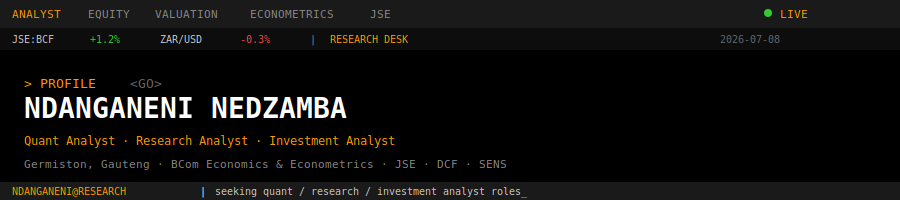

<div align="center">



<br/>


<br/>

[](https://github.com/Ndanga02)
[](https://www.linkedin.com/in/ndanganeninedzamba)
[](mailto:ndanganedz@gmail.com)
[](https://github.com/Ndanga02/Ndanga02.github.io)

</div>

---

## `ANALYST PROFILE <GO>`

```text
┌─ NDANGANENI NEDZAMBA ─────────────────────────────────────────────┐
│  ROLE       Quant Analyst · Research Analyst · Investment Analyst │
│  LOCATION   Germiston, Gauteng, South Africa                      │
│  EDUCATION  BCom Economics & Econometrics — University of JHB     │
│  COVERAGE   JSE equities · DCF · Graham screening · SENS        │
│  STACK      Python · R · SQL · Excel · Power BI · Econometrics    │
│  STATUS     Open to analyst / research roles                      │
└───────────────────────────────────────────────────────────────────┘
```

**Quant · Research · Investment Analyst** targeting equity research and valuation roles. BCom in **Economics & Econometrics** (UJ). Former **Graduate Business Analyst** at Computershare SA — investor analytics, ML models, automated reporting. Building **Graham Guardian**: JSE small-cap monitor with DCF models, SENS alerts, and portfolio milestones.

> Turning messy data into investment insight — econometrics, valuation, and disciplined research.

---

## `FUNCTIONS`

| Module | Coverage |
|--------|----------|
| **VAL** | DCF modelling, financial statement analysis, Graham-style equity screening |
| **QUANT** | Regression, classification, model optimisation, Scikit-learn |
| **ECON** | OLS, Probit, panel data, causal inference — R & Python |
| **DATA** | SQL, Pandas, Power BI, Excel, NumPy, investor analytics |
| **AUTO** | Python pipelines, PostgreSQL, Supabase — research tools on GitHub Actions |

<br/>


---

## `RESEARCH TOOLS`

| Ticker | Repo | Description |
|--------|------|-------------|
| **GGD** | [`graham-guardian`](https://github.com/Ndanga02/graham-guardian) | JSE monitor — DCF, SENS, Graham rules, milestone alerts |
| **LMS** | [`LMS`](https://github.com/Ndanga02/LMS) | Learning management platform |
| **ECO** | *in development* | Economics & market visualisation |
| **WEB** | [`Ndanga02.github.io`](https://github.com/Ndanga02/Ndanga02.github.io) | Professional site |

---

## `ACTIVITY`

<div align="center">


</div>

---

## `HIGHLIGHTS`

| Metric | Result |
|--------|--------|
| Stop Trade Flag ML model | **88%** accuracy (Computershare) |
| Email domain correction | **+64.6%** deliverability |
| Investor return-email pattern | **72%** Tue/Thu concentration (Power BI) |
| Graham Guardian | Automated JSE DCF screen + SENS + portfolio alerts |

---

## `STATUS LINE`

```diff
+ OPEN TO:  Quant Analyst · Research Analyst · Investment Analyst
+ FOCUS:    Equity research, valuation, econometrics, SA markets
+ BUILDING: Research infrastructure that runs while markets are closed
```

<div align="center">

---


[](https://visitcount.itsvg.in)

*`NDANGANENI@RESEARCH | last update 2026`*

</div>